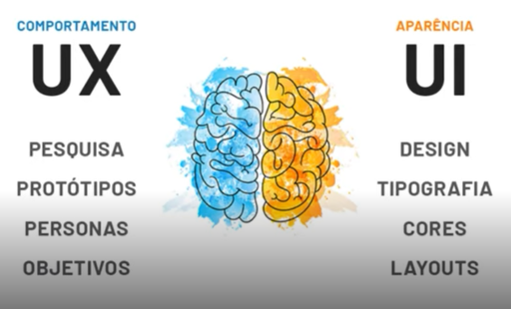

## Sistemas Desktop
>Sistemas desktop são sistemas autônomos que podem ser instalados no computador. Normalmente instalavel por arquivos executáveis, para utilizar este programa você precisa está no mesmo local geográfico que o computador assim tornando limitado o uso do software.

## Sistema Web
>Sistemas baseados em tecnologia web, podendo ser utilizados remotamente através de qualquer navegador de internet, sem a necessidade de instalação e uso local.

## Sistema Mobile
>Uma aplicação móvel ou mobile é um software desenvolvido para ser instalado em smartphones/tablets. É instalavel por lojas de aplicativos, exemplo Google Play e App Store, possuí a facilidade de ser acessível de qualquer local, desde que esteja com um dispositivel móvel em mão.

## UX Design (User Experience)
>O design da experiência do usuário é o processo que visa melhorar a satisfação do usuário com um produto ou serviço, melhorando a usabilidade, a acessibilidade e até mesmo a satisfação proporcionada na interação.

>Essa pessoa vai entender o cliente e com base em suas pesquisas do cliente vai realizar um esboço/esqueleto do projeto, como por exemplo menus, botões, barra de pesquisa, navbar, etc.

>Etapas a seguir:
 - Realizar **Pesquisas** do cliente;
 - Criar **Protótipos** do projeto;
 - Entender que é a **Persona** a uitlizar este software;
 - E entender os **Objetivos** dessa aplicação;

## UI Design (User Interface)
>O designer de interface do usuário é o profissional responsável em criar o que o usuário irá ver e utilizar, ele entende padrões visuais que podem ajudar o usuário na experiência de utilização do software.

>Este profissional está responsável pelas **Cores**, **Tipografia**, **Layouts** e **Design** da aplicação.

>Essas duas funções pode ser realizadas pela mesma pessoa.

## Modelo Cliente-Servidor
>O modelo cliente-servidor é uma estrutura de aplicação que distribui as tarefas e cargas de trabalho entre os fornecedores de um recurso ou serviço, designados como servidores, e os requerentes dos serviços, designados como clientes.

>Hoje, todos as aplicações são pensadas para funcionar como cliente-servidor.

## Desenvolvedor Front End
>O desenvolvedor Front End é o profissional que programa a parte visual da aplicação, ou seja, tudo o que conseguimos interagir. O Desenvolvedor front end é responsável por desenvolver por meio de códigos uma interface gráfica normalmente com tecnologia base da web (HTML, CSS, JavaScript).

>O desenvolvedor utiliza um software chamado **IDE** onde facilida o desenvolvimento das aplicações, não é necessario utilizar a IDE para programar, mas ela facilida o processo já que conta com facilidades para auxiliar na programação.

## Frameworks
>Framework é, de forma básica, um facilitador.

>Ele traz diversas soluções já pré-definas, que descomplicam o trabalho dos profissionais no desenvolvimento de aplicativos e outros projetos digitais.

>Afinal, a atuação de um programador pode ter muita criatividade, mas também traz aspectos mecânicos, de repetição de tarefas, que seriam maçantes sem a possibilidade de automatização. Exemplos, Angular, Laravel e Vue.

