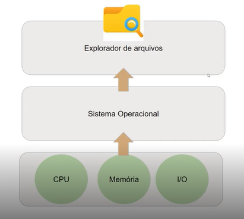
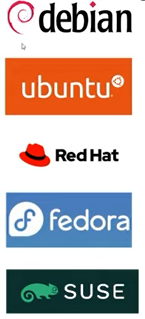

# Linux

## O que é um sistema operacional?
>O sistema operacional é um software, ou conjunto de softwares, que tem a função de administrar e gerenciar os recursos de um sistema. Esses recursos são: componentes de hardware, sistemas de arquivos, programas de terceiros, etc.

>Qual a principal função do sistema operacional? Estabelecer uma interface entre o **hardware** e o **software**.

### Kernel
>Resumidamente o **KERNEL** é a ponte entre o **usuário** e o **hardware**. O kernel seria o núcleo do sistema, compõe a parte central do SO e responde por tarefas cruciais, como:
 - Estabelecer a camada de abstração de baixo nível (linguagem de máquina) com o hardware;
 - Gerenciar recursos como processador, RAM, sistemas de arquivos e dispositivos de entrada e saída;
 - Gerenciar processos (execução) de programas;
 - Gerenciar o uso de dispositivos, memória do sistema e chamadas de programas, definindo quais têm prioridade;

>Os sistemas operacionais domésticos mais utilizados:
 - Microsoft Windows (Windows 8, Windows 10, Windows 11);
 - Mac OS (Sistema para computadores Apple);
 - Linux (Ubuntu, Pop_OS, Mint, etc);

## O que é Linux?
>O linux é um dos sistemas operacionais mais populares e é amplamente utilizado no segmento de **servidores** e por **desenvolvedores de softwares**. Ainda existe um grande espaço para crescimento no segmento de computadores pessoais.

>O kernel do linux começou a ser desenvolvido por Linus Torvalds em 1991 inspirado no Unix, em outro sistema operacional criado nos anos 70. O desenvolvimento inicial do kernel do linux começou com Linus ainda quando estava na faculdade em Helsinki, Finlândia.

>O Linux, mais especificamente o kernel do sistema operacional, não é suportado por uma empresa individual, mas por uma comunidade internacional de desenvolvedores. O kernel do Linux está disponível gratuitamente e pode ser usado por qualquer pessoa, sem restrições. O kernel é mantido pela Linux Foundation, que é uma organização sem fins, lucrativos. Para manter o kernel atualizado e implementar melhorias, a fundação é mantida por doações de grandes empresas que utilizam o Linux em seus produtos ou serviços.

## Distribuição
>Uma distribuição Linux é um pacote que consiste em um kernel linux, mais uma seleção de aplicativos mantidos por uma empresa ou comunidade de usuários. O objetivo de uma distribuição é otimizar o kernel e os aplicativos que rodam no sistema operacional para um determinado tipo de uso ou grupo de usuários.

### Sistemas embarcados
>Os sistemas embarcados são uma combinação de hardware e software projetados para cumprir uma função específica dentro de uma sistema maior. Normalmente fazem parte de outros dispositivos e ajudam a controlá-los. Podem ser encontrados em aplicações automotivas, médicas e até militares. O Android é um sistema operacional móvel desenvolvido principalmente pelo Google. A empresa inicialmente criou um sistema operacional destinado a rodar em câmeras digitais.

